<div align="center">


<h1>sabori-flow</h1>

<p><strong>Claude Code CLI で GitHub Issue を自動解決するワーカー。</strong><br>
ラベルを付けるだけで、方針策定から実装、Pull Request 作成まで sabori-flow が自動で処理します。</p>

<p>
  <a href="LICENSE"></a>
  
  
  
</p>

<p>
  <a href="README.md">English</a> | <a href="README.ja.md">日本語</a>
</p>

</div>

## sabori とは？

"sabori" は日本語の「サボり」に由来しています。sabori-flow は**賢くサボる**ためのツールです。定型的なタスクは AI に任せて、人間は頭を使うべき仕事に集中しましょう。

GitHub Issue にラベルを付けるだけで、sabori-flow がバックグラウンドで Issue を読み、方針を立て、コードを実装し、Pull Request を作成します。**ラベルを付けたら、あとは放置。**

sabori-flow は **AI プロダクトではなく、ワークフロープロダクト**です。Issue 検出、ラベルによる状態遷移、隔離実行、構造化された出力といったパイプラインの設計が本体であり、Issue を解く LLM が何であるかは実装の詳細です。

## 設計思想

### スクリプトがオーケストレーションし、AI が課題を解く

sabori-flow ではオーケストレーション（TypeScript）と問題解決（AI）を分離しています。
**AI は Issue の理解とコーディングに集中** し、それ以外はワーカーが担当します。

| ワーカー（決定的） | AI エージェント（知的） |
|---|---|
| Issue 取得、ラベルフィルタ、優先度ソート | Issue を読み、要件を理解する |
| ラベル遷移（plan → in-progress → done） | アプローチを計画し、コードを書く |
| git worktree の作成・削除 | コミット作成、ブランチ push |
| コメント投稿、シークレットマスキング | -- |
| エラーハンドリングとリカバリ | -- |

Issue の操作やラベルの管理は機械的な作業なので、決まったルールどおりに動くスクリプトで十分です。わざわざ AI にやらせるとトークンも消費しますし、ハルシネーションのリスクもあります。

### CLI 実行による完全自動化

AI チャットアプリやデスクトップツールは、ファイル編集・コマンド実行・git 操作のたびに承認確認を求めます。
自動処理のはずなのに、AIチャットアプリに通知やアイコンバウンドで呼ばれたりしませんでしたか？
自動処理したいのに、人間が張り付いて「許可」を押し続けるのでは本末転倒です。

### LLM 非依存のアーキテクチャ

AI エージェントはパイプライン内の 1 つの CLI 呼び出しです。現在は Claude Code CLI を使っていますが、OpenAI Codex や GitHub Copilot CLI など、CLI ベースの AI エージェントであれば差し替えられる設計です。*（マルチエンジン対応は計画中です。）*

どの LLM を使うかより、ワークフローの設計のほうが大事だと考えています。

### 現実的なフロー

マルチエージェント連携やツール使用ループといった AI オーケストレーション技術は魅力的ですが、多くのチームにとって今すぐ効果があるのは、**今あるワークフローの中に AI を組み込む**ことではないでしょうか。

GitHub Issue を書いて、PR をレビューして、マージする。sabori-flow はこの流れの「真ん中」を自動化するだけです。

```
[Issue を書く] → [ラベルを付ける] → [sabori-flow] → [PR をレビュー] → [マージ]
```

新しいツールやパラダイムを導入するのではなく、チームが普段やっていることの延長線上で使えるようにしています。

## Claude Scheduled Tasks との比較

Claude には [Scheduled Tasks](https://code.claude.com/docs/en/scheduled-tasks)（cron ベースのプロンプト自動実行、Cloud / Desktop）があります。

| | sabori-flow | Claude Scheduled Tasks |
|---|---|---|
| **アプローチ** | ワークフロー駆動（Issue ラベルがパイプラインを起動） | プロンプト駆動（cron が固定プロンプトを実行） |
| **状態管理** | 組み込み（ラベル遷移で進捗を追跡） | ステートレス（毎回ゼロから） |
| **自動化レベル** | CLI 実行で完全自動（承認ダイアログなし） | 半自動（App が承認確認を要求） |
| **AI 依存** | LLM 非依存（CLI インターフェース、エンジン差し替え可能） | Claude 専用 |
| **コードアクセス** | git worktree 経由（高速、clone 不要） | Cloud: fresh clone / Desktop: ローカル checkout |
| **マルチリポジトリ** | `config.yml` による並列実行を組み込み対応 | タスクごとに 1 リポジトリ |
| **出力** | PR + Issue コメント（ステータス追跡付き） | セッションログ |
| **セキュリティ** | シークレットマスキング、作成者権限チェック | Anthropic サンドボックス / Desktop パーミッション |
| **カスタマイズ性** | TypeScript パイプライン全体 + プロンプトテンプレート | プロンプトのみ |
| **PC オフ時の動作** | 不可 | Cloud: 可能 |

### Claude Scheduled Tasks を使うべき場面

- **マシンがオフでも実行したい**場合（Cloud タスク）。
- **Issue 駆動ではない自動化**
- **コード不要のセットアップ**で、プロンプト 1 つで十分な場合。

## 前提条件

- macOS
- Node.js v20+
- [Claude Code CLI](https://docs.anthropic.com/en/docs/claude-code) (`claude`)
- [GitHub CLI](https://cli.github.com/) (`gh`) -- 認証済みであること

## セットアップ

```bash
# 1. 対話的に config.yml を作成
npx sabori-flow init

# 2. launchd に登録して定期実行を開始
npx sabori-flow install
```

`install` コマンドは plist 生成と launchd への登録を行います。

### リポジトリの追加

既存の `config.yml` に新しいリポジトリを追加するには

```bash
npx sabori-flow add
```

owner、repo、ローカルパスを対話的に入力し、`config.yml` にエントリを追加します。同じ owner/repo が既に存在する場合は上書き確認が表示されます。

### アンインストール

```bash
npx sabori-flow uninstall
```

launchd からの登録解除と関連ファイルの削除が行われます。

## 使い方

### ワークフロー

Issue にラベルを付けるだけです。ワーカーが 1 時間ごとに自動検出して処理します。

```mermaid
flowchart TD
    A["Issue に claude/plan ラベルを付ける"] --> B["ワーカーが Plan フェーズを実行"]
    B --> C{成功&#63;}
    C -- Yes --> D["Issue に plan コメントを投稿"]
    C -- No --> E["claude/plan&#58;failed ラベルを付与"]
    D --> F["ユーザーが plan をレビューし claude/impl ラベルを付ける"]
    F --> G["ワーカーが Impl フェーズを実行"]
    G --> H{成功&#63;}
    H -- Yes --> I["Pull Request を作成"]
    H -- No --> J["claude/impl&#58;failed ラベルを付与"]
```



### ラベル遷移

```mermaid
flowchart LR
    A["claude/plan"] --> B["claude/plan&#58;in-progress"]
    B --> C["claude/plan&#58;done"]
    B --> D["claude/plan&#58;failed"]

    E["claude/impl"] --> F["claude/impl&#58;in-progress"]
    F --> G["claude/impl&#58;done"]
    F --> H["claude/impl&#58;failed"]
```



### 失敗した場合

処理が失敗すると `failed` ラベルが付き、Issue に失敗コメントが投稿されます。

1. `~/.sabori-flow/logs/worker.log` で詳細を確認
2. 必要に応じて Issue の内容を修正
3. `failed` ラベルを外して、再度 `claude/plan` または `claude/impl` を付ける

### 運用

**登録状況の確認:**

```bash
launchctl list | grep sabori-flow
```

```
-	0	com.github.nonz250.sabori-flow
```

左から PID（未実行なら `-`）、最後の終了コード、ラベル名。

**スケジュールを待たず即時実行:**

```bash
launchctl start com.github.nonz250.sabori-flow
```

**ログの場所:**

```
~/.sabori-flow/logs/worker.log              # ワーカーのログ（日次ローテーション、7日保持）
~/.sabori-flow/logs/launchd_stdout.log      # launchd 経由の標準出力
~/.sabori-flow/logs/launchd_stderr.log      # launchd 経由の標準エラー出力
```

## 設定

設定ファイルは `~/.config/sabori-flow/config.yml` に保存されます。`config.yml.example` を参考に作成するか、`npx sabori-flow init` で対話的に生成できます。

```yaml
repositories:
  - owner: nonz250
    repo: example-app
    local_path: /path/to/repo
    labels:
      plan:
        trigger: claude/plan
        in_progress: "claude/plan:in-progress"
        done: "claude/plan:done"
        failed: "claude/plan:failed"
      impl:
        trigger: claude/impl
        in_progress: "claude/impl:in-progress"
        done: "claude/impl:done"
        failed: "claude/impl:failed"
    priority_labels:
      - priority:high
      - priority:low

execution:
  max_parallel: 1
  max_issues_per_repo: 1
```

| キー | 説明 |
|------|------|
| `repositories[].owner` | リポジトリオーナー |
| `repositories[].repo` | リポジトリ名 |
| `repositories[].local_path` | ローカルのクローン先パス |
| `repositories[].labels` | 各フェーズのラベル名（カスタマイズ可能） |
| `repositories[].labels.plan` | plan フェーズのラベル: `trigger`, `in_progress`, `done`, `failed` |
| `repositories[].labels.impl` | impl フェーズのラベル: `trigger`, `in_progress`, `done`, `failed` |
| `repositories[].priority_labels` | 優先度ラベル。リストの上位ほど先に処理される |
| `execution.max_parallel` | 並列実行数。デフォルトは `1`（逐次実行） |
| `execution.max_issues_per_repo` | リポジトリあたりの Issue 処理上限。デフォルトは `1` |

## セキュリティ

このツールは Claude Code CLI を `--dangerously-skip-permissions` で実行するため、マシン上でほぼ任意の操作が可能です。launchd により定期的にユーザー操作なしで実行されます。

デフォルトの `npx` 方式では、実行時に npm レジストリからパッケージを取得します。万が一 npm パッケージが侵害された場合、悪意あるコードがスケジューラにより自動実行される可能性があります。

加えて、以下の防御策が組み込まれています。

- **Issue 作成者の権限チェック** -- OWNER、MEMBER、COLLABORATOR 以外のユーザーが作成した Issue は自動的にスキップされます。
- **シークレットマスキング** -- 成功コメント投稿前に出力をスキャンし、シークレットを自動的にマスクします。
- **ランダムバウンダリトークン** -- プロンプトにランダムなバウンダリトークンを使用し、プロンプトインジェクションを緩和します。

このリスクを軽減したい場合、`--local` フラグを使用して、あなたがたチーム全体でローカルコードを監査し、監査済み��ローカルビルドとしてら実行してください。

```bash
git clone https://github.com/nonz250/sabori-flow.git
cd sabori-flow
npm install
npm run build
node dist/index.js init
node dist/index.js install --local
```

## ライセンス

[MIT](LICENSE)
