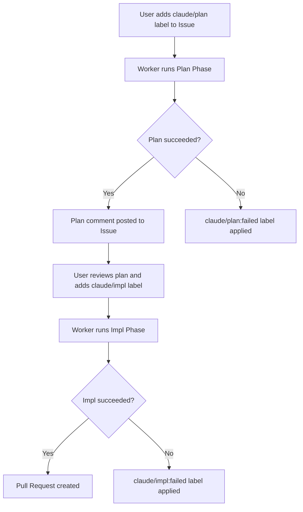

<div align="center">


<p><strong>Claude Code CLI で GitHub Issue を自動解決するワーカー。</strong><br>
ラベルを付けるだけで、方針策定から実装、Pull Request 作成まで sabori-flow が自動で処理します。</p>

<p>
  <a href="LICENSE"></a>
  
  
  
</p>

<p>
  <a href="README.md">English</a> | <a href="README.ja.md">日本語</a>
</p>

</div>

## 前提条件

- macOS
- Node.js v20+
- [Claude Code CLI](https://docs.anthropic.com/en/docs/claude-code) (`claude`)
- [GitHub CLI](https://cli.github.com/) (`gh`) -- 認証済みであること

## セットアップ

```bash
# 1. 依存インストール + ビルド
npm install
npm run build

# 2. 対話的に config.yml を作成
node dist/index.js init

# 3. launchd に登録して定期実行を開始
node dist/index.js install
```

`install` コマンドはビルド、plist 生成、launchd への登録をまとめて行います。

### アンインストール

```bash
node dist/index.js uninstall
```

launchd からの登録解除と関連ファイルの削除が行われます。

## 使い方

### ワークフロー

Issue にラベルを付けるだけです。ワーカーが 1 時間ごとに自動検出して処理します。



### ラベル遷移

```
あなたが付けるラベル       ワーカーが自動遷移
-----------------     ------------------------------------------

claude/plan  -->  claude/plan:in-progress  --+--> claude/plan:done
                                             +--> claude/plan:failed

claude/impl  -->  claude/impl:in-progress  --+--> claude/impl:done
                                             +--> claude/impl:failed
```

### 失敗した場合

処理が失敗すると `failed` ラベルが付き、Issue に失敗コメントが投稿されます。

1. `logs/worker.log` で詳細を確認
2. 必要に応じて Issue の内容を修正
3. `failed` ラベルを外して、再度 `claude/plan` または `claude/impl` を付ける

### 運用

**登録状況の確認:**

```bash
launchctl list | grep sabori-flow
```

```
-	0	com.github.nonz250.sabori-flow
```

左から PID（未実行なら `-`）、最後の終了コード、ラベル名。

**スケジュールを待たず即時実行:**

```bash
launchctl start com.github.nonz250.sabori-flow
```

**ログの場所:**

```
logs/worker.log              # ワーカーのログ（日次ローテーション、7日保持）
logs/launchd_stdout.log      # launchd 経由の標準出力
logs/launchd_stderr.log      # launchd 経由の標準エラー出力
```

## 設定

`config.yml.example` を参考に `config.yml` を作成するか、`node dist/index.js init` で対話的に生成できます。

```yaml
repositories:
  - owner: nonz250
    repo: example-app
    local_path: /path/to/repo
    labels:
      plan:
        trigger: claude/plan
        in_progress: "claude/plan:in-progress"
        done: "claude/plan:done"
        failed: "claude/plan:failed"
      impl:
        trigger: claude/impl
        in_progress: "claude/impl:in-progress"
        done: "claude/impl:done"
        failed: "claude/impl:failed"
    priority_labels:
      - priority:high
      - priority:low

execution:
  max_parallel: 1
```

| キー | 説明 |
|------|------|
| `repositories[].owner` | リポジトリオーナー |
| `repositories[].repo` | リポジトリ名 |
| `repositories[].local_path` | ローカルのクローン先パス |
| `repositories[].labels` | 各フェーズのラベル名（カスタマイズ可能） |
| `repositories[].labels.plan` | plan フェーズのラベル: `trigger`, `in_progress`, `done`, `failed` |
| `repositories[].labels.impl` | impl フェーズのラベル: `trigger`, `in_progress`, `done`, `failed` |
| `repositories[].priority_labels` | 優先度ラベル。リストの上位ほど先に処理される |
| `execution.max_parallel` | 並列実行数。デフォルトは `1`（逐次実行） |

## ライセンス

[MIT](LICENSE)
