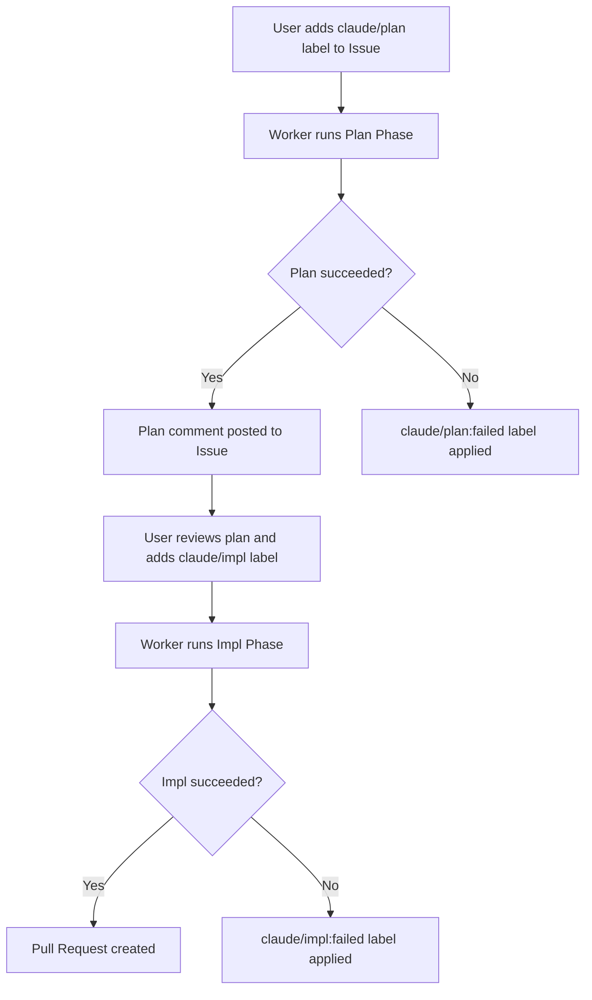
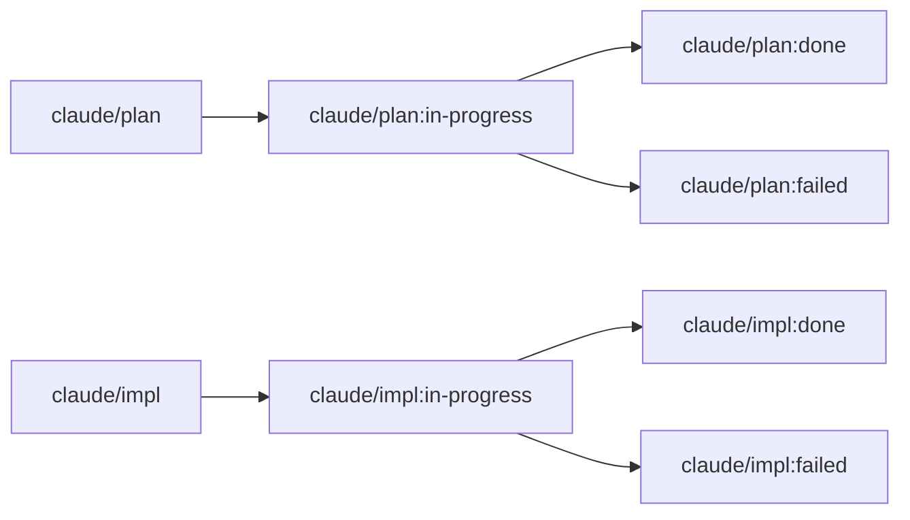

<div align="center">


<p><strong>Claude Code CLI で GitHub Issue を自動解決するワーカー。</strong><br>
ラベルを付けるだけで、方針策定から実装、Pull Request 作成まで sabori-flow が自動で処理します。</p>

<p>
  <a href="LICENSE"></a>
  
  
  
</p>

<p>
  <a href="README.md">English</a> | <a href="README.ja.md">日本語</a>
</p>

</div>

## sabori とは？

"sabori" は日本語の「サボり」に由来しています。サボる＝怠ける、という意味ですが、sabori-flow では**賢くサボる**ことを目指しています。退屈で定型的なタスクを AI に任せ、人間は本当に頭を使うべき仕事に集中する -- そんなワークフローを実現するツールです。

GitHub Issue にラベルを付けるだけで、sabori-flow がバックグラウンドで Issue を読み、方針を立て、コードを実装し、Pull Request を作成します。**ラベルを付けたら、あとは放置**。それが sabori-flow のコンセプトです。

## sabori-flow vs Claude App

sabori-flow と [Claude](https://claude.ai/)（チャットインターフェース）は同じ AI を利用していますが、用途が大きく異なります:

| | sabori-flow | Claude App |
|---|---|---|
| **実行方式** | バックグラウンド自動実行（launchd） | 手動チャット |
| **トリガー** | GitHub Issue のラベル | ユーザーのプロンプト入力 |
| **コードアクセス** | ローカルリポジトリに直接アクセス | コピー＆ペーストまたはファイルアップロード |
| **出力** | Pull Request + Issue コメント | チャットレスポンス |
| **適用場面** | 定型タスク・明確な Issue の自動処理 | 対話的な設計・調査・議論 |
| **人間の介入** | ラベル付与 + plan レビューのみ | 常時対話 |

**sabori-flow を使う場面**: Issue に書ける程度に明確なタスクで、対話のやり取りが不要なとき。**Claude App を使う場面**: アイデアを探りたい、追加の質問をしたい、曖昧な問題を対話的に解決したいとき。

## 前提条件

- macOS
- Node.js v20+
- [Claude Code CLI](https://docs.anthropic.com/en/docs/claude-code) (`claude`)
- [GitHub CLI](https://cli.github.com/) (`gh`) -- 認証済みであること

## セットアップ

```bash
# 1. 対話的に config.yml を作成
npx sabori-flow init

# 2. launchd に登録して定期実行を開始
npx sabori-flow install
```

`install` コマンドは plist 生成と launchd への登録を行います。

### リポジトリの追加

既存の `config.yml` に新しいリポジトリを追加するには:

```bash
npx sabori-flow add
```

owner、repo、ローカルパスを対話的に入力し、`config.yml` にエントリを追加します。同じ owner/repo が既に存在する場合は上書き確認が表示されます。

### アンインストール

```bash
npx sabori-flow uninstall
```

launchd からの登録解除と関連ファイルの削除が行われます。

## 使い方

### ワークフロー

Issue にラベルを付けるだけです。ワーカーが 1 時間ごとに自動検出して処理します。



### ラベル遷移



### 失敗した場合

処理が失敗すると `failed` ラベルが付き、Issue に失敗コメントが投稿されます。

1. `~/.sabori-flow/logs/worker.log` で詳細を確認
2. 必要に応じて Issue の内容を修正
3. `failed` ラベルを外して、再度 `claude/plan` または `claude/impl` を付ける

### 運用

**登録状況の確認:**

```bash
launchctl list | grep sabori-flow
```

```
-	0	com.github.nonz250.sabori-flow
```

左から PID（未実行なら `-`）、最後の終了コード、ラベル名。

**スケジュールを待たず即時実行:**

```bash
launchctl start com.github.nonz250.sabori-flow
```

**ログの場所:**

```
~/.sabori-flow/logs/worker.log              # ワーカーのログ（日次ローテーション、7日保持）
~/.sabori-flow/logs/launchd_stdout.log      # launchd 経由の標準出力
~/.sabori-flow/logs/launchd_stderr.log      # launchd 経由の標準エラー出力
```

## 設定

設定ファイルは `~/.config/sabori-flow/config.yml` に保存されます。`config.yml.example` を参考に作成するか、`npx sabori-flow init` で対話的に生成できます。

```yaml
repositories:
  - owner: nonz250
    repo: example-app
    local_path: /path/to/repo
    labels:
      plan:
        trigger: claude/plan
        in_progress: "claude/plan:in-progress"
        done: "claude/plan:done"
        failed: "claude/plan:failed"
      impl:
        trigger: claude/impl
        in_progress: "claude/impl:in-progress"
        done: "claude/impl:done"
        failed: "claude/impl:failed"
    priority_labels:
      - priority:high
      - priority:low

execution:
  max_parallel: 1
  max_issues_per_repo: 1
```

| キー | 説明 |
|------|------|
| `repositories[].owner` | リポジトリオーナー |
| `repositories[].repo` | リポジトリ名 |
| `repositories[].local_path` | ローカルのクローン先パス |
| `repositories[].labels` | 各フェーズのラベル名（カスタマイズ可能） |
| `repositories[].labels.plan` | plan フェーズのラベル: `trigger`, `in_progress`, `done`, `failed` |
| `repositories[].labels.impl` | impl フェーズのラベル: `trigger`, `in_progress`, `done`, `failed` |
| `repositories[].priority_labels` | 優先度ラベル。リストの上位ほど先に処理される |
| `execution.max_parallel` | 並列実行数。デフォルトは `1`（逐次実行） |
| `execution.max_issues_per_repo` | リポジトリあたりの Issue 処理上限。デフォルトは `1` |

## セキュリティ

このツールは Claude Code CLI を `--dangerously-skip-permissions` で実行するため、マシン上でほぼ任意の操作が可能です。launchd により定期的にユーザー操作なしで実行されます。

デフォルトの `npx` 方式では、実行時に npm レジストリからパッケージを取得します。万が一 npm パッケージが侵害された場合、悪意あるコードがスケジューラにより自動実行される可能性があります。

加えて、以下の防御策が組み込まれています:

- **Issue 作成者の権限チェック** -- OWNER、MEMBER、COLLABORATOR 以外のユーザーが作成した Issue は自動的にスキップされます。
- **シークレットマスキング** -- 成功コメント投稿前に出力をスキャンし、シークレットを自動的にマスクします。
- **ランダムバウンダリトークン** -- プロンプトにランダムなバウンダリトークンを使用し、プロンプトインジェクションを緩和します。

このリスクを軽減するには、`--local` フラグを使用して、監査済みのローカルビルドから実行してください:

```bash
git clone https://github.com/nonz250/sabori-flow.git
cd sabori-flow
npm install
npm run build
node dist/index.js init
node dist/index.js install --local
```

## ライセンス

[MIT](LICENSE)
