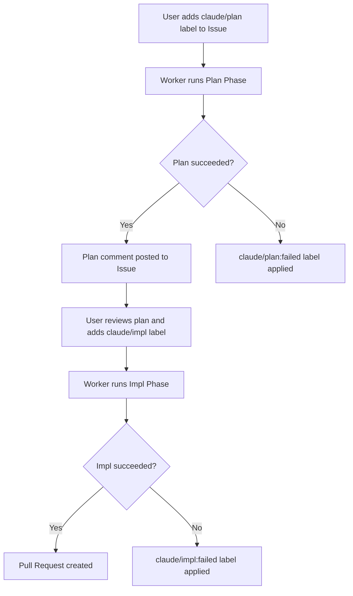
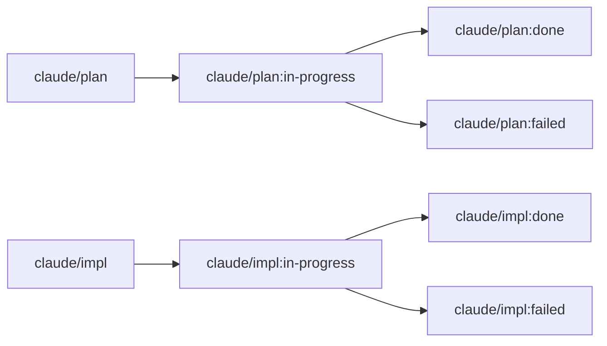

<div align="center">


<p><strong>Automated GitHub Issue resolver powered by Claude Code CLI.</strong><br>
Add a label to an Issue -- sabori-flow handles the rest: planning, implementation, and pull request creation.</p>

<p>
  <a href="LICENSE"></a>
  
  
  
</p>

<p>
  <a href="README.md">English</a> | <a href="README.ja.md">日本語</a>
</p>

</div>

## What is sabori?

The name "sabori" comes from the Japanese word "サボり" (sabori), meaning to slack off or skip work. But there is a twist -- sabori-flow lets you slack off **responsibly** by delegating tedious, well-defined tasks to AI so you can focus on the work that actually needs a human brain.

Just add a label to a GitHub Issue, and sabori-flow takes care of the rest: it reads the issue, creates a plan, implements the code, and opens a pull request -- all running quietly in the background on your machine. It is a **set-and-forget** workflow for the boring stuff.

## sabori-flow vs Claude Scheduled Tasks

Claude now offers [Scheduled Tasks](https://code.claude.com/docs/en/scheduled-tasks) -- cron-based automation that runs prompts on a schedule (Cloud or Desktop). sabori-flow takes a fundamentally different approach: **Issue-driven**, not prompt-driven.

| | sabori-flow | Claude Scheduled Tasks (Cloud) | Claude Scheduled Tasks (Desktop) |
|---|---|---|---|
| **Trigger** | GitHub Issue label | Cron schedule + fixed prompt | Cron schedule + fixed prompt |
| **Workflow** | Automatic state machine (label transitions: plan → in-progress → done/failed) | Stateless -- each run starts fresh | Stateless -- each run starts fresh |
| **Code access** | Local repository via git worktree (fast, no clone overhead) | Fresh clone every run | Local checkout or worktree |
| **Multi-repo** | Built-in (`config.yml` manages multiple repos with parallel execution) | One task per repo | One task per repo |
| **Output** | Pull request + Issue comment with status tracking | Session log, manual PR creation | Session log, manual PR creation |
| **Security** | Secret masking on output, Issue author permission check, shell-free execution | Anthropic sandbox | Desktop permission settings |
| **Customization** | Full TypeScript pipeline, Markdown prompt templates | Prompt only | Prompt only |
| **Dependency** | Claude Code CLI + `gh` CLI (no app required) | claude.ai account + paid plan | Desktop app must be running |
| **Runs while PC is off** | No | Yes | No |

### Why sabori-flow?

- **Issue = task.** No need to write cron prompts that describe what to do -- just write a GitHub Issue and add a label. The Issue itself is the specification.
- **Stateful pipeline.** Label transitions (`claude/plan` → `claude/plan:in-progress` → `claude/plan:done`) give you visibility into what is happening and what has been processed. Claude Scheduled Tasks are stateless -- they have no built-in concept of "which issues have been handled."
- **Safe parallel execution.** git worktree isolates each Issue into its own working copy without touching your current branch. No interference with your ongoing work.
- **Output you can trust.** Secrets are automatically masked before posting comments to Issues. Error handling has three levels to ensure no Issue gets stuck in a broken state.
- **Fully hackable.** The entire pipeline is TypeScript -- swap out the prompt templates, adjust the label scheme, add custom post-processing. Claude Scheduled Tasks only let you change the prompt.

### When to use Claude Scheduled Tasks instead

- You need tasks to run **even when your machine is off** (Cloud tasks).
- Your automation is **not Issue-driven** -- e.g., daily code review summaries, periodic dependency checks, Slack notifications.
- You prefer a **zero-code setup** where a single prompt is enough.

## Prerequisites

- macOS
- Node.js v20+
- [Claude Code CLI](https://docs.anthropic.com/en/docs/claude-code) (`claude`)
- [GitHub CLI](https://cli.github.com/) (`gh`) -- must be authenticated

## Setup

```bash
# 1. Create config.yml interactively
npx sabori-flow init

# 2. Register with launchd for periodic execution
npx sabori-flow install
```

The `install` command generates the plist file and registers with launchd.

### Adding a Repository

To add a new repository to an existing `config.yml`:

```bash
npx sabori-flow add
```

This interactively prompts for owner, repo, and local path, then appends the entry to `config.yml`. If the same owner/repo already exists, you will be asked whether to overwrite it.

### Uninstall

```bash
npx sabori-flow uninstall
```

This unregisters from launchd and removes related files.

## Usage

### Workflow

Add a label to an Issue. The worker automatically detects it every hour and processes it.



### Label Transitions



### Handling Failures

When processing fails, a `failed` label is applied and a failure comment is posted to the Issue.

1. Check `~/.sabori-flow/logs/worker.log` for details
2. Fix the Issue content as needed
3. Remove the `failed` label and re-apply `claude/plan` or `claude/impl`

### Operations

**Check registration status:**

```bash
launchctl list | grep sabori-flow
```

```
-	0	com.github.nonz250.sabori-flow
```

The columns are: PID (`-` if not running), last exit code, and label name.

**Run immediately without waiting for schedule:**

```bash
launchctl start com.github.nonz250.sabori-flow
```

**Log locations:**

```
~/.sabori-flow/logs/worker.log              # Worker log (daily rotation, 7-day retention)
~/.sabori-flow/logs/launchd_stdout.log      # stdout via launchd
~/.sabori-flow/logs/launchd_stderr.log      # stderr via launchd
```

## Configuration

The configuration file is stored at `~/.config/sabori-flow/config.yml`. Create it based on `config.yml.example`, or generate it interactively with `npx sabori-flow init`.

```yaml
repositories:
  - owner: nonz250
    repo: example-app
    local_path: /path/to/repo
    labels:
      plan:
        trigger: claude/plan
        in_progress: "claude/plan:in-progress"
        done: "claude/plan:done"
        failed: "claude/plan:failed"
      impl:
        trigger: claude/impl
        in_progress: "claude/impl:in-progress"
        done: "claude/impl:done"
        failed: "claude/impl:failed"
    priority_labels:
      - priority:high
      - priority:low

execution:
  max_parallel: 1
  max_issues_per_repo: 1
```

| Key | Description |
|-----|-------------|
| `repositories[].owner` | Repository owner |
| `repositories[].repo` | Repository name |
| `repositories[].local_path` | Local path to the cloned repository |
| `repositories[].labels` | Label names for each phase (customizable) |
| `repositories[].labels.plan` | Labels for the plan phase: `trigger`, `in_progress`, `done`, `failed` |
| `repositories[].labels.impl` | Labels for the impl phase: `trigger`, `in_progress`, `done`, `failed` |
| `repositories[].priority_labels` | Priority labels. Issues with labels higher in the list are processed first |
| `execution.max_parallel` | Number of parallel executions. Default is `1` (sequential) |
| `execution.max_issues_per_repo` | Maximum number of issues to process per repository. Default is `1` |

## Security

This tool runs Claude Code CLI with `--dangerously-skip-permissions`, which allows nearly arbitrary operations on your machine. It is executed periodically by launchd without user interaction.

By default, the `npx` installation fetches packages from the npm registry at runtime. If the npm package were compromised, malicious code could be executed automatically by the scheduler.

Additionally, the following defenses are built in:

- **Author permission check** -- Only issues created by users with OWNER, MEMBER, or COLLABORATOR association are processed; others are automatically skipped.
- **Secret masking** -- Before posting a success comment, output is scanned and secrets are automatically masked.
- **Random boundary tokens** -- Prompts use randomized boundary tokens to mitigate prompt injection.

To mitigate this risk, use the `--local` flag to run from a locally built copy you can audit:

```bash
git clone https://github.com/nonz250/sabori-flow.git
cd sabori-flow
npm install
npm run build
node dist/index.js init
node dist/index.js install --local
```

## License

[MIT](LICENSE)
