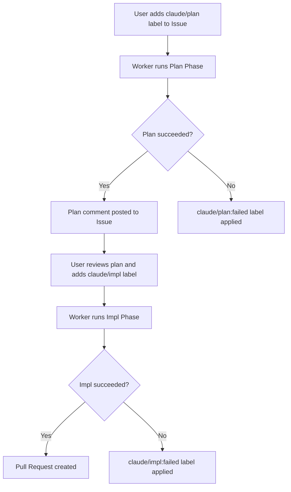
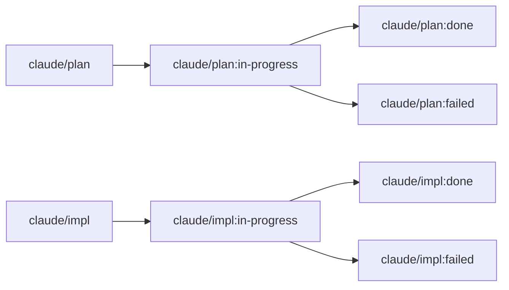

<div align="center">


<p><strong>Automated GitHub Issue resolver powered by Claude Code CLI.</strong><br>
Add a label to an Issue -- sabori-flow handles the rest: planning, implementation, and pull request creation.</p>

<p>
  <a href="LICENSE"></a>
  
  
  
</p>

<p>
  <a href="README.md">English</a> | <a href="README.ja.md">日本語</a>
</p>

</div>

## Prerequisites

- macOS
- Node.js v20+
- [Claude Code CLI](https://docs.anthropic.com/en/docs/claude-code) (`claude`)
- [GitHub CLI](https://cli.github.com/) (`gh`) -- must be authenticated

## Setup

```bash
# 1. Install dependencies and build
npm install
npm run build

# 2. Create config.yml interactively
node dist/index.js init

# 3. Register with launchd for periodic execution
node dist/index.js install
```

The `install` command performs the build, generates the plist file, and registers with launchd.

### Uninstall

```bash
node dist/index.js uninstall
```

This unregisters from launchd and removes related files.

## Usage

### Workflow

Add a label to an Issue. The worker automatically detects it every hour and processes it.



### Label Transitions



### Handling Failures

When processing fails, a `failed` label is applied and a failure comment is posted to the Issue.

1. Check `logs/worker.log` for details
2. Fix the Issue content as needed
3. Remove the `failed` label and re-apply `claude/plan` or `claude/impl`

### Operations

**Check registration status:**

```bash
launchctl list | grep sabori-flow
```

```
-	0	com.github.nonz250.sabori-flow
```

The columns are: PID (`-` if not running), last exit code, and label name.

**Run immediately without waiting for schedule:**

```bash
launchctl start com.github.nonz250.sabori-flow
```

**Log locations:**

```
logs/worker.log              # Worker log (daily rotation, 7-day retention)
logs/launchd_stdout.log      # stdout via launchd
logs/launchd_stderr.log      # stderr via launchd
```

## Configuration

Create `config.yml` based on `config.yml.example`, or generate it interactively with `node dist/index.js init`.

```yaml
repositories:
  - owner: nonz250
    repo: example-app
    local_path: /path/to/repo
    labels:
      plan:
        trigger: claude/plan
        in_progress: "claude/plan:in-progress"
        done: "claude/plan:done"
        failed: "claude/plan:failed"
      impl:
        trigger: claude/impl
        in_progress: "claude/impl:in-progress"
        done: "claude/impl:done"
        failed: "claude/impl:failed"
    priority_labels:
      - priority:high
      - priority:low

execution:
  max_parallel: 1
```

| Key | Description |
|-----|-------------|
| `repositories[].owner` | Repository owner |
| `repositories[].repo` | Repository name |
| `repositories[].local_path` | Local path to the cloned repository |
| `repositories[].labels` | Label names for each phase (customizable) |
| `repositories[].labels.plan` | Labels for the plan phase: `trigger`, `in_progress`, `done`, `failed` |
| `repositories[].labels.impl` | Labels for the impl phase: `trigger`, `in_progress`, `done`, `failed` |
| `repositories[].priority_labels` | Priority labels. Issues with labels higher in the list are processed first |
| `execution.max_parallel` | Number of parallel executions. Default is `1` (sequential) |

## License

[MIT](LICENSE)
