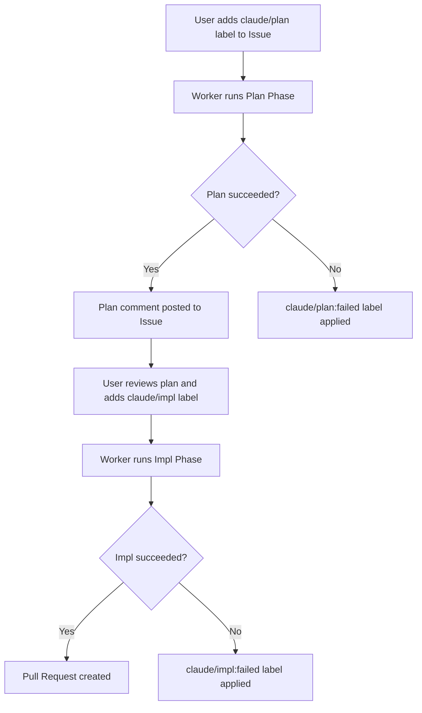
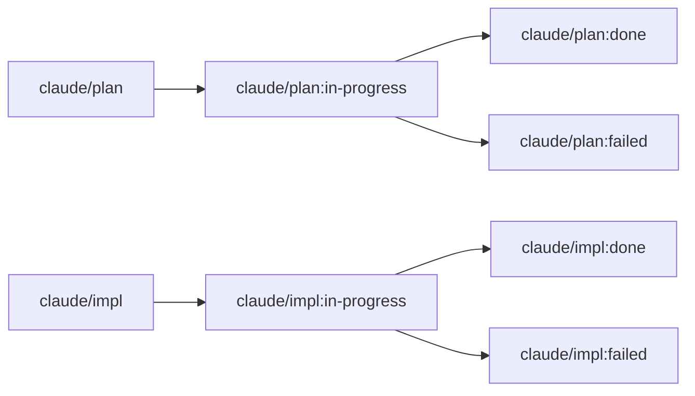

<div align="center">


<p><strong>Automated GitHub Issue resolver powered by Claude Code CLI.</strong><br>
Add a label to an Issue -- sabori-flow handles the rest: planning, implementation, and pull request creation.</p>

<p>
  <a href="LICENSE"></a>
  
  
  
</p>

<p>
  <a href="README.md">English</a> | <a href="README.ja.md">日本語</a>
</p>

</div>

## What is sabori?

The name "sabori" comes from the Japanese word "サボり" (sabori), meaning to slack off or skip work. sabori-flow is a tool for **slacking off responsibly**: let AI handle the tedious, well-defined tasks so you can focus on the work that actually needs your brain.

Add a label to a GitHub Issue, and sabori-flow handles the rest: reading the Issue, planning, implementing, and opening a pull request. **Label it and forget it.**

sabori-flow is a **workflow product**, not an AI product. The pipeline design (Issue detection, label-driven state transitions, isolated execution, structured output) is the core value. Which LLM solves the Issue is an implementation detail.

## Design Philosophy

### Script orchestrates, AI solves

sabori-flow separates orchestration (TypeScript) from problem-solving (AI).
**The AI focuses on understanding the Issue and writing code.** Everything else is handled by TypeScript scripts.

| TypeScript script (deterministic) | AI agent (intelligent) |
|---|---|
| Fetch Issues, filter by label, sort by priority | Read the Issue, understand the requirement |
| Transition labels (plan → in-progress → done) | Plan the approach, write code |
| Create / clean up git worktrees | Create commits, push branches |
| Post comments, mask secrets in output | -- |
| Error handling and recovery | -- |

Issue operations and label management are mechanical. A deterministic script handles them just fine. Having the AI do it wastes tokens and introduces hallucination risk.

### Truly automated via CLI

AI chat apps and desktop tools ask for permission confirmations on every file edit, command execution, and git operation.
Have you ever been interrupted by a notification or a bouncing dock icon from an AI chat app during "automated" processing?
If someone has to sit there clicking "Allow" over and over, that defeats the purpose of automation.

### LLM-agnostic architecture

The AI agent is a single CLI call in the pipeline. It currently uses Claude Code CLI, but any CLI-based AI agent (OpenAI Codex, GitHub Copilot CLI, etc.) can be swapped in without changing the workflow. *(Multi-engine support is planned but not yet implemented.)*

The workflow design matters more than which LLM you plug into it.

### Realistic flow for real teams

Multi-agent orchestration and tool-use loops are exciting technologies, but for many teams the more immediate win is simpler: **integrate AI into the workflow you already have.**

You already write GitHub Issues, review PRs, and use labels. sabori-flow just automates the middle part.

```
[Write Issue] → [Add label] → [sabori-flow] → [Review PR] → [Merge]
```

No new paradigm to adopt. It works as an extension of what your team is already doing.

## Comparison with Claude Scheduled Tasks

Claude offers [Scheduled Tasks](https://code.claude.com/docs/en/scheduled-tasks) -- cron-based prompt automation (Cloud and Desktop).

| | sabori-flow | Claude Scheduled Tasks |
|---|---|---|
| **Approach** | Workflow-driven (Issue label triggers pipeline) | Prompt-driven (cron runs a fixed prompt) |
| **State management** | Built-in (label transitions track progress) | Stateless (each run starts from scratch) |
| **Automation level** | Fully automated via CLI (no permission dialogs) | Semi-automated (App requires confirmations) |
| **AI dependency** | LLM-agnostic (CLI interface, swappable engine) | Claude only |
| **Code access** | Local repo via git worktree (fast, no clone) | Cloud: fresh clone / Desktop: local checkout |
| **Multi-repo** | Built-in parallel execution via `config.yml` | One task per repo |
| **Output** | PR + Issue comment with status tracking | Session log |
| **Security** | Secret masking, author permission check | Anthropic sandbox / Desktop permissions |
| **Customization** | Full TypeScript pipeline + prompt templates | Prompt text only |
| **Runs while PC is off** | No | Cloud: Yes |

### When to use Claude Scheduled Tasks instead

- You need tasks to run **when your machine is off** (Cloud tasks).
- Your automation is **not Issue-driven**.
- You prefer a **zero-code setup** where a prompt is enough.

## Prerequisites

- macOS
- Node.js v20+
- [Claude Code CLI](https://docs.anthropic.com/en/docs/claude-code) (`claude`)
- [GitHub CLI](https://cli.github.com/) (`gh`) -- must be authenticated

## Setup

```bash
# 1. Create config.yml interactively
npx sabori-flow init

# 2. Register with launchd for periodic execution
npx sabori-flow install
```

The `install` command generates the plist file and registers with launchd.

### Adding a Repository

To add a new repository to an existing `config.yml`.

```bash
npx sabori-flow add
```

This interactively prompts for owner, repo, and local path, then appends the entry to `config.yml`. If the same owner/repo already exists, you will be asked whether to overwrite it.

### Uninstall

```bash
npx sabori-flow uninstall
```

This unregisters from launchd and removes related files.

## Usage

### Workflow

Add a label to an Issue. The worker automatically detects it every hour and processes it.



### Label Transitions



### Handling Failures

When processing fails, a `failed` label is applied and a failure comment is posted to the Issue.

1. Check `~/.sabori-flow/logs/worker.log` for details
2. Fix the Issue content as needed
3. Remove the `failed` label and re-apply `claude/plan` or `claude/impl`

### Operations

**Check registration status:**

```bash
launchctl list | grep sabori-flow
```

```
-	0	com.github.nonz250.sabori-flow
```

The columns are: PID (`-` if not running), last exit code, and label name.

**Run immediately without waiting for schedule:**

```bash
launchctl start com.github.nonz250.sabori-flow
```

**Log locations:**

```
~/.sabori-flow/logs/worker.log              # Worker log (daily rotation, 7-day retention)
~/.sabori-flow/logs/launchd_stdout.log      # stdout via launchd
~/.sabori-flow/logs/launchd_stderr.log      # stderr via launchd
```

## Configuration

The configuration file is stored at `~/.config/sabori-flow/config.yml`. Create it based on `config.yml.example`, or generate it interactively with `npx sabori-flow init`.

```yaml
repositories:
  - owner: nonz250
    repo: example-app
    local_path: /path/to/repo
    labels:
      plan:
        trigger: claude/plan
        in_progress: "claude/plan:in-progress"
        done: "claude/plan:done"
        failed: "claude/plan:failed"
      impl:
        trigger: claude/impl
        in_progress: "claude/impl:in-progress"
        done: "claude/impl:done"
        failed: "claude/impl:failed"
    priority_labels:
      - priority:high
      - priority:low

execution:
  max_parallel: 1
  max_issues_per_repo: 1
```

| Key | Description |
|-----|-------------|
| `repositories[].owner` | Repository owner |
| `repositories[].repo` | Repository name |
| `repositories[].local_path` | Local path to the cloned repository |
| `repositories[].labels` | Label names for each phase (customizable) |
| `repositories[].labels.plan` | Labels for the plan phase: `trigger`, `in_progress`, `done`, `failed` |
| `repositories[].labels.impl` | Labels for the impl phase: `trigger`, `in_progress`, `done`, `failed` |
| `repositories[].priority_labels` | Priority labels. Issues with labels higher in the list are processed first |
| `execution.max_parallel` | Number of parallel executions. Default is `1` (sequential) |
| `execution.max_issues_per_repo` | Maximum number of issues to process per repository. Default is `1` |

## Security

This tool runs Claude Code CLI with `--dangerously-skip-permissions`, which allows nearly arbitrary operations on your machine. It is executed periodically by launchd without user interaction.

By default, the `npx` installation fetches packages from the npm registry at runtime. If the npm package were compromised, malicious code could be executed automatically by the scheduler.

Additionally, the following defenses are built in.

- **Author permission check** -- Only issues created by users with OWNER, MEMBER, or COLLABORATOR association are processed; others are automatically skipped.
- **Secret masking** -- Before posting a success comment, output is scanned and secrets are automatically masked.
- **Random boundary tokens** -- Prompts use randomized boundary tokens to mitigate prompt injection.

To mitigate this risk, use the `--local` flag to run from a locally built copy you can audit.

```bash
git clone https://github.com/nonz250/sabori-flow.git
cd sabori-flow
npm install
npm run build
node dist/index.js init
node dist/index.js install --local
```

## License

[MIT](LICENSE)
